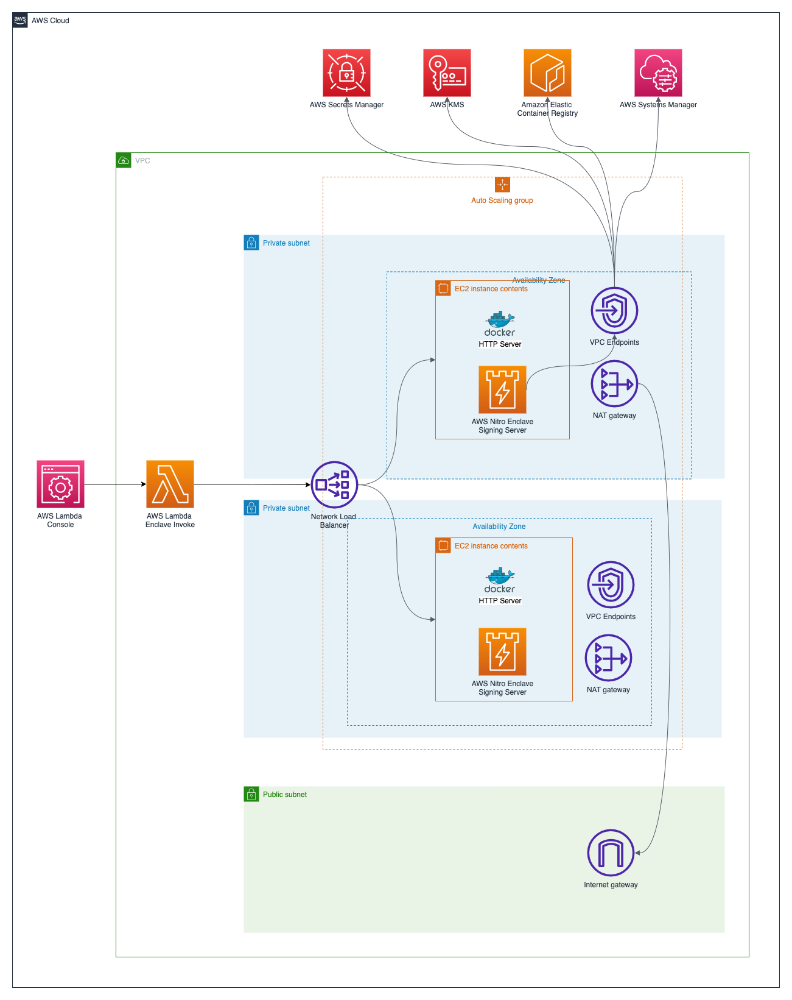
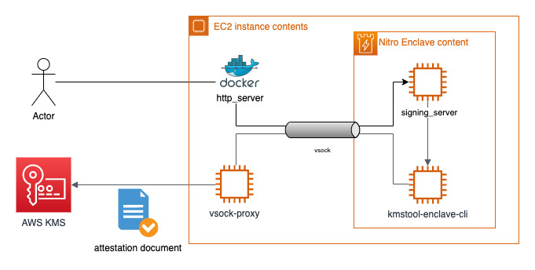

# AWS Nitro Enclave Blockchain Wallet and Advanced Networking Patterns

This project represents an example implementation of an AWS Nitro Enclave based blockchain account management solution a.k.a. a wallet.
It's implemented in AWS Cloud Development Kit (CDK) v2 and Python.

This repository contains all code artifacts for the following three blog posts:
1. [AWS Nitro Enclaves for secure blockchain key management: Part 1](https://aws.amazon.com/blogs/database/part-1-aws-nitro-enclaves-for-secure-blockchain-key-management/)
2. [AWS Nitro Enclaves for secure blockchain key management: Part 2](https://aws.amazon.com/blogs/database/part-2-aws-nitro-enclaves-for-secure-blockchain-key-management/)
3. [AWS Nitro Enclaves for secure blockchain key management: Part 3](https://aws.amazon.com/blogs/database/part-3-aws-nitro-enclaves-for-secure-blockchain-key-management/)

For an overview of how to design an AWS Nitro Enclave based blockchain application please have a look at the [first blog post](https://aws.amazon.com/blogs/database/part-1-aws-nitro-enclaves-for-secure-blockchain-key-management/).

For a walkthrough of how to deploy and configure the Nitro Enclave based blockchain key management solution please refer to the [second blog post](https://aws.amazon.com/blogs/database/part-2-aws-nitro-enclaves-for-secure-blockchain-key-management/).

For a deep dive into Nitro Enclaves and the explanation of features like cryptographic attestation and additional information about the general architecture of a Nitro Enclaves-based Ethereum signing application please refer to [third blog post](https://aws.amazon.com/blogs/database/part-3-aws-nitro-enclaves-for-secure-blockchain-key-management/).

For an AWS Workshop Studio based walkthrough please refer to [Leveraging AWS Nitro Enclaves for Secure Blockchain Key Management](https://catalog.workshops.aws/nitrowallet).

For Nitro Enclave advanced networking patterns, please refer to the respective application folders.
1. [Wireguard TUN Interface](./application/wireguard/README.md)
2. [Socat TUN Interface](./application/socat/README.md)
3. [HTTPS Outbound](./application/rds_integration/README.md)
4. [HTTPS Inbound](./application/https_web_server/README.md)
5. [SQS Queue Integration](./application/dotnet_sqs_integration/README.md)

## Architecture

### High Level


### Application


## Deploying the solution with AWS CDK

Deploying the solution with the AWS CDK The AWS CDK is an open-source framework for defining and provisioning cloud
application resources. It uses common programming languages such as JavaScript, C#, and Python.
The [AWS CDK command line interface](https://docs.aws.amazon.com/cdk/latest/guide/cli.html) (CLI) allows you to interact
with CDK applications. It provides features like synthesizing AWS CloudFormation templates, confirming the security
changes, and deploying applications.

This section shows how to prepare the environment for running CDK and the sample code. For this walkthrough, you must
have the following prerequisites:

* An [AWS account](https://signin.aws.amazon.com/signin?redirect_uri=https%3A%2F%2Fportal.aws.amazon.com%2Fbilling%2Fsignup%2Fresume&client_id=signup).
* An IAM user with administrator access
* [Configured AWS credentials](https://docs.aws.amazon.com/cdk/latest/guide/getting_started.html#getting_started_prerequisites)
* Installed Node.js, Python 3, and pip. To install the example application:

When working with Python, it’s good practice to use [venv](https://docs.python.org/3/library/venv.html#module-venv) to
create project-specific virtual environments. The use of `venv` also reflects AWS CDK standard behavior. You can find
out more in the
workshop [Activating the virtualenv](https://cdkworkshop.com/30-python/20-create-project/200-virtualenv.html).

1. Install the CDK and test the CDK CLI:
    ```bash
    npm install -g aws-cdk && cdk --version
    ```
   
2. Download the code from the GitHub repo and switch in the new directory:
    ```bash
    git clone https://github.com/aws-samples/aws-nitro-enclave-blockchain-wallet.git && cd aws-nitro-enclave-blockchain-wallet
    ```
3. Install the dependencies using the Python package manager:
   ```bash
   pip install -r requirements.txt
   ```
4. Specify the AWS region and account for your deployment:
   ```bash
   export CDK_DEPLOY_REGION=us-east-1
   export CDK_DEPLOY_ACCOUNT=$(aws sts get-caller-identity | jq -r '.Account')
   export CDK_APPLICATION_TYPE=eth1
   export CDK_PREFIX=dev
   ```
   You can set the ```CDK_PREFIX``` variable as per your preference.

5. Trigger the `kmstool_enclave_cli` build:
   ```bash
   ./scripts/build_kmstool_enclave_cli.sh
   ```

6. Deploy the example code with the CDK CLI:
    ```bash
    cdk deploy ${CDK_PREFIX}NitroWalletEth
    ```

## KMS Key Policy

```json5
{
  "Version": "2012-10-17",
  "Statement": [
    {
      "Sid": "Enable decrypt from enclave",
      "Effect": "Allow",
      "Principal": {
        "AWS": <devNitroWalletEth.EC2InstanceRoleARN>
      },
      "Action": "kms:Decrypt",
      "Resource": "*",
      "Condition": {
        "StringEqualsIgnoreCase": {
          "kms:RecipientAttestation:ImageSha384": <PCR0_VALUE_FROM_EIF_BUILD>
        }
      }
    },
    {
      "Sid": "Enable encrypt from lambda",
      "Effect": "Allow",
      "Principal": {
        "AWS": <devNitroWalletEth.LambdaExecutionRoleARN>
      },
      "Action": "kms:Encrypt",
      "Resource": "*"
    },
    {
      "Effect": "Allow",
      "Principal": {
        "AWS": <KMS_ADMINISTRATOR_ROLE_ARN>
      },
      "Action": [
        "kms:Create*",
        "kms:Describe*",
        "kms:Enable*",
        "kms:List*",
        "kms:Put*",
        "kms:Update*",
        "kms:Revoke*",
        "kms:Disable*",
        "kms:Get*",
        "kms:Delete*",
        "kms:ScheduleKeyDeletion",
        "kms:CancelKeyDeletion",
        "kms:GenerateDataKey",
        "kms:TagResource",
        "kms:UntagResource"
      ],
      "Resource": "*"
    }
  ]
}
```

To leverage the provided `generate_key_policy.sh` script, a CDK output file needs to be provided.
This file can be created by running the following command:
```bash
cdk deploy devNitroWalletEth -O output.json
```

After the `output.json` file has been created, the following command can be used to create the KMS key policy:
```bash
./scripts/generate_key_policy.sh ./output.json
```

If the debug mode has been turned on by appending `--debug-mode` to the enclaves start sequence, the enclaves PCR0 value in the AWS KMS key policy needs to be updated to `000000000000000000000000000000000000000000000000000000000000000000000000000000000000000000000000`,
otherwise AWS KMS will return error code `400`.

## Key Generation and Requests

### Create Ethereum Key

Use the command below to create a temporary Ethereum private key.

```bash
openssl ecparam -name secp256k1 -genkey -noout | openssl ec -text -noout > key
cat key | grep priv -A 3 | tail -n +2 | tr -d '\n[:space:]:' | sed 's/^00//'
```

Use the following command to calculate the corresponding public address for your temporary Ethereum key created in the previous step.
[keccak-256sum](https://github.com/maandree/sha3sum) binary needs to be made available to execute the calculation step successfully.

```bash
cat key | grep pub -A 5 | tail -n +2 | tr -d '\n[:space:]:' | sed 's/^04//' > pub
echo "0x$(cat pub | keccak-256sum -x -l | tr -d ' -' | tail -c 41)"
```

Please be aware that the calculated public address does not comply with the valid mixed-case checksum encoding standard for Ethereum addresses specified in [EIP-55](https://github.com/ethereum/EIPs/blob/master/EIPS/eip-55.md).

### Set Ethereum Key

Replace the Ethereum key placeholder in the JSON request below and use the request to encrypt and store the Ethereum key
via the Lambda `test` console:

```json
{
  "operation": "set_key",
  "eth_key": <ethereum_key_placeholder>
}
```

### Sign EIP-1559 Transaction

Use the request below to sign an Ethereum EIP-1559 transaction with the saved Ethereum key using the Labda `test`
console:

```json
{
  "operation": "sign_transaction",
  "transaction_payload": {
    "value": 0.01,
    "to": "0xa5D3241A1591061F2a4bB69CA0215F66520E67cf",
    "nonce": 0,
    "type": 2,
    "chainId": 4,
    "gas": 100000,
    "maxFeePerGas": 100000000000,
    "maxPriorityFeePerGas": 3000000000
  }
}
```

## Cleaning up

Once you have completed the deployment and tested the application, clean up the environment to avoid incurring extra
cost. This command removes all resources in this stack provisioned by the CDK:

```bash
cdk destroy
```

## Security

See [CONTRIBUTING](CONTRIBUTING.md#security-issue-notifications) for more information.

## License

This library is licensed under the MIT-0 License. See the LICENSE file.
