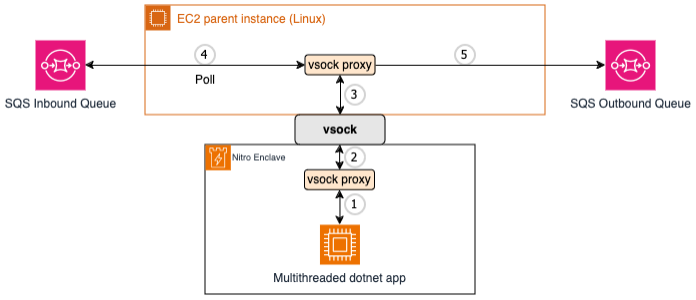

# AWS Nitro Enclave with Amazon Simple Queue Service (Amazon SQS)

This pattern represents an example implementation of an AWS Nitro Enclave processing messages from an Amazon SQS queue.


## Architecture




## Deploying the solution with AWS CDK

Deploying the solution with the AWS CDK The AWS CDK is an open-source framework for defining and provisioning cloud
application resources. It uses common programming languages such as JavaScript, C#, and Python.
The [AWS CDK command line interface](https://docs.aws.amazon.com/cdk/latest/guide/cli.html) (CLI) allows you to interact
with CDK applications. It provides features like synthesizing AWS CloudFormation templates, confirming the security
changes, and deploying applications.

This section shows how to prepare the environment for running CDK and the sample code. For this walkthrough, you must
have the following prerequisites:

* An [AWS account](https://signin.aws.amazon.com/signin?redirect_uri=https%3A%2F%2Fportal.aws.amazon.com%2Fbilling%2Fsignup%2Fresume&client_id=signup).
* An IAM user with administrator access
* [Configured AWS credentials](https://docs.aws.amazon.com/cdk/latest/guide/getting_started.html#getting_started_prerequisites)
* Installed Node.js, Python 3, and pip. To install the example application:

When working with Python, it’s good practice to use [venv](https://docs.python.org/3/library/venv.html#module-venv) to
create project-specific virtual environments. The use of `venv` also reflects AWS CDK standard behavior. You can find
out more in the
workshop [Activating the virtualenv](https://cdkworkshop.com/30-python/20-create-project/200-virtualenv.html).

1. Install the CDK and test the CDK CLI:
    ```bash
    npm install -g aws-cdk && cdk --version
    ```
   
2. Download the code from the GitHub repo and switch in the new directory:
    ```bash
    git clone https://github.com/aws-samples/aws-nitro-enclave-blockchain-wallet.git && cd aws-nitro-enclave-blockchain-wallet
    ```
3. Install the dependencies using the Python package manager:
   ```bash
   pip install -r requirements.txt
   ```
4. Specify the AWS region and account for your deployment:
   ```bash
   export CDK_DEPLOY_REGION=us-east-1
   export CDK_DEPLOY_ACCOUNT=$(aws sts get-caller-identity | jq -r '.Account')
   export CDK_APPLICATION_TYPE=dotnet_sqs_integration
   export CDK_PREFIX=dev
   ```
   You can set the ```CDK_PREFIX``` variable as per your preference.

5. Trigger the `vsock-proxy` build:
   ```bash
   ./scripts/build_vsock_proxy.sh
   ```

6. Build the dotnet app:
   ```bash
   ./scripts/build_dotnet_app.sh
   ```

7. Deploy the example code with the CDK CLI:
    ```bash
    cdk deploy ${CDK_PREFIX}NitroDotnetSqsIntegration
    ```

8. Navigate to the EC2 console, copy the instance id of the EC2 instance, and connect to the instance via AWS Systems Manager (make sure you have the [Session Manager plugin](https://docs.aws.amazon.com/systems-manager/latest/userguide/session-manager-working-with-install-plugin.html) installed):
    ```bash
    aws ssm start-session --target <EC2 instance id> --region ${CDK_DEPLOY_REGION}
    ```

9. Switch to ec2-user:
    ```bash
    sudo su ec2-user
    ```

10. Attach to the signing_server enclave (ensure that the enclave has been deployed with --debug-mode flag). You should see the logs showing the source and target SQS queues.
    ```bash
    nitro-cli console --enclave-name signing_server
    ```

11. Go to SQS on the AWS Console and send a message in the Source_Queue.


12. Observe the logs on the enclave console, you will see the message being picked by the enclave.


13. Switch back to SQS and poll for messages on the Target_Queue, you will see a response message coming from the enclave.


## Cleaning up

Once you have completed the deployment and tested the application, clean up the environment to avoid incurring extra
cost. This command removes all resources in this stack provisioned by the CDK:

```bash
cdk destroy
```

## Security

See [CONTRIBUTING](CONTRIBUTING.md#security-issue-notifications) for more information.

## License

This library is licensed under the MIT-0 License. See the LICENSE file.
