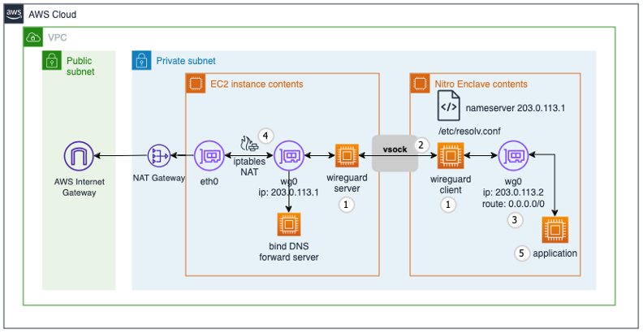

# AWS Nitro Enclave with Wireguard TUN Interface

This pattern represents an example implementation of Wireguard based dynamic routing from an AWS Nitro enclave.
Wireguard is a communication protocol and open-source software that implements encrypted virtual private networks (VPNs). It provides a fast and scalable layer 3 encryption with minimal overhead.


## Architecture




## Security Considerations 

[//]: # (&#40;TODO&#41;)
* Unlimited outbound communication
* TLS termination inside the enclave based on ephemeral private/public key
* DNS filtering on bind required e.g. whitelist certain domains otherwise traffic cannot be controlled at all
* enclave can establish outbound conection and authenticate itself to a customer server 


## Deploying the solution with AWS CDK

Deploying the solution with the AWS CDK The AWS CDK is an open-source framework for defining and provisioning cloud
application resources. It uses common programming languages such as JavaScript, C#, and Python.
The [AWS CDK command line interface](https://docs.aws.amazon.com/cdk/latest/guide/cli.html) (CLI) allows you to interact
with CDK applications. It provides features like synthesizing AWS CloudFormation templates, confirming the security
changes, and deploying applications.

This section shows how to prepare the environment for running CDK and the sample code. For this walkthrough, you must
have the following prerequisites:

* An [AWS account](https://signin.aws.amazon.com/signin?redirect_uri=https%3A%2F%2Fportal.aws.amazon.com%2Fbilling%2Fsignup%2Fresume&client_id=signup).
* An IAM user with administrator access
* [Configured AWS credentials](https://docs.aws.amazon.com/cdk/latest/guide/getting_started.html#getting_started_prerequisites)
* Installed Node.js, Python 3, and pip. To install the example application:

When working with Python, it’s good practice to use [venv](https://docs.python.org/3/library/venv.html#module-venv) to
create project-specific virtual environments. The use of `venv` also reflects AWS CDK standard behavior. You can find
out more in the
workshop [Activating the virtualenv](https://cdkworkshop.com/30-python/20-create-project/200-virtualenv.html).

1. Install the CDK and test the CDK CLI:
    ```bash
    npm install -g aws-cdk && cdk --version
    ```
   
2. Download the code from the GitHub repo and switch in the new directory:
    ```bash
    git clone https://github.com/aws-samples/aws-nitro-enclave-blockchain-wallet.git && cd aws-nitro-enclave-blockchain-wallet
    ```
3. Install the dependencies using the Python package manager:
   ```bash
   pip install -r requirements.txt
   ```
4. Specify the AWS region and account for your deployment:
   ```bash
   export CDK_DEPLOY_REGION=us-east-1
   export CDK_DEPLOY_ACCOUNT=$(aws sts get-caller-identity | jq -r '.Account')
   export CDK_APPLICATION_TYPE=wireguard
   export CDK_PREFIX=dev
   ```
   You can set the ```CDK_PREFIX``` variable as per your preference.

**Disclaimer**
Please be aware that the credentials handling in this readme does not reflect best practices. Credentials should never 
be hardcoded in plaintext in source code, binaries or docker images. The purpose of this repo is about to showcase how
a TUN interface can be created between the controlling docker container located on the parent instance and the enclave 
itself. For production use-cases, the credentials should be encrypted and loaded into the enclave after it has been started 
e.g. leveraging the `cryptographic attestation` mechanism natively securing the connection between Nitro Enclaves and KMS.


5. Create a wireguard server and client config. You can do this via the `wg` cli or leverage [wireguardconfig.com](https://www.wireguardconfig.com/).

6. Create the following environment variables for the private and public keys:
    
   ```bash
   export WG_SERVER_PRIVATE_KEY=<server base64 private key>
   export WG_SERVER_PUBLIC_KEY=<server base64 public key>
   export WG_CLIENT_PRIVATE_KEY=<client base64 private key>
   export WG_CLIENT_PUBLIC_KEY=<client base64 public key>
   ```

7. Trigger the wireguard binaries build:
   ```bash
   ./scripts/build_wireguard.sh
   ```
   
8. Trigger the `kmstool_enclave_cli` build:
   ```bash
   ./scripts/build_kmstool_enclave_cli.sh
   ```

9. Deploy the example code with the CDK CLI:
    ```bash
    cdk deploy ${CDK_PREFIX}NitroWireguard --verbose --require-approval=never
    ```

10. Get the EC2 instances associated with the Auto Scaling Group (ASG) by using the `devNitroWireguard.ASGGroupName` parameter from the `cdk deploy` output.
    ```bash
    ./scripts/get_asg_instances.sh <autoscaling group name>
    ```

11. Connect to the EC2 instance via AWS Systems Manager:
    ```bash
    aws ssm start-session --target <EC2 instance id> --region ${CDK_DEPLOY_REGION}
    ```    
    Note: If Session Manager plugin is not installed, you can install it by following this [guide](https://docs.aws.amazon.com/systems-manager/latest/userguide/session-manager-working-with-install-plugin.html).

12. Switch to `ec2-user` and attach to the `signing_server` enclave:
    ```bash
    sudo su ec2-user
    ```
    
13. You should now be able to see incoming DNS requests from the enclave on `bind` running in the docker container (`wg_server`)
    on the EC2 parent instance:
    ```bash
    docker logs -f wg_server
    ```
    
    ```bash
    26-Mar-2024 09:34:23.122 client @0x7ff7322840d0 203.0.113.2#56244 (aws.com): query: aws.com IN A + (203.0.113.1)
    26-Mar-2024 09:34:23.122 client @0x7ff732285100 203.0.113.2#56244 (aws.com): query: aws.com IN AAAA + (203.0.113.1)
    ```

    You can attach to the enclave and see the ping command being executed towards the `aws.com` domain:
    ```bash
    nitro-cli console --enclave-name signing_server
    ```

    ```bash
    + ping -c 4 aws.com
    PING aws.com (13.32.99.108): 56 data bytes
    64 bytes from 13.32.99.108: seq=0 ttl=245 time=2.979 ms
    64 bytes from 13.32.99.108: seq=1 ttl=245 time=1.901 ms
    64 bytes from 13.32.99.108: seq=2 ttl=245 time=2.155 ms
    64 bytes from 13.32.99.108: seq=3 ttl=245 time=2.041 ms
    
    --- aws.com ping statistics ---
    4 packets transmitted, 4 packets received, 0% packet loss
    round-trip min/avg/max = 1.901/2.269/2.979 ms    
    ```

14. Clean up environment variables:
    ```bash
    unset WG_SERVER_PRIVATE_KEY
    unset WG_SERVER_PUBLIC_KEY
    unset WG_CLIENT_PRIVATE_KEY
    unset WG_CLIENT_WG_SERVER_PUBLIC_KEY
    ```

## KMS Key Policy

```json5
{
  "Version": "2012-10-17",
  "Statement": [
    {
      "Sid": "Enable decrypt from enclave",
      "Effect": "Allow",
      "Principal": {
        "AWS": <devNitroWalletEth.EC2InstanceRoleARN>
      },
      "Action": "kms:Decrypt",
      "Resource": "*",
      "Condition": {
        "StringEqualsIgnoreCase": {
          "kms:RecipientAttestation:ImageSha384": <PCR0_VALUE_FROM_EIF_BUILD>
        }
      }
    },
    {
      "Sid": "Enable encrypt from lambda",
      "Effect": "Allow",
      "Principal": {
        "AWS": <devNitroWalletEth.LambdaExecutionRoleARN>
      },
      "Action": "kms:Encrypt",
      "Resource": "*"
    },
    {
      "Effect": "Allow",
      "Principal": {
        "AWS": <KMS_ADMINISTRATOR_ROLE_ARN>
      },
      "Action": [
        "kms:Create*",
        "kms:Describe*",
        "kms:Enable*",
        "kms:List*",
        "kms:Put*",
        "kms:Update*",
        "kms:Revoke*",
        "kms:Disable*",
        "kms:Get*",
        "kms:Delete*",
        "kms:ScheduleKeyDeletion",
        "kms:CancelKeyDeletion",
        "kms:GenerateDataKey",
        "kms:TagResource",
        "kms:UntagResource"
      ],
      "Resource": "*"
    }
  ]
}
```

To leverage the provided `generate_key_policy.sh` script, a CDK output file needs to be provided.
This file can be created by running the following command:
```bash
cdk deploy devNitroWalletEth -O output.json
```

After the `output.json` file has been created, the following command can be used to create the KMS key policy:
```bash
./scripts/generate_key_policy.sh ./output.json
```

If the debug mode has been turned on by appending `--debug-mode` to the enclaves start sequence, the enclaves PCR0 value in the AWS KMS key policy needs to be updated to `000000000000000000000000000000000000000000000000000000000000000000000000000000000000000000000000`,
otherwise AWS KMS will return error code `400`.

## Key Generation and Requests

### Create Ethereum Key

Use the command below to create a temporary Ethereum private key.

```bash
openssl ecparam -name secp256k1 -genkey -noout | openssl ec -text -noout > key
cat key | grep priv -A 3 | tail -n +2 | tr -d '\n[:space:]:' | sed 's/^00//'
```

Use the following command to calculate the corresponding public address for your temporary Ethereum key created in the previous step.
[keccak-256sum](https://github.com/maandree/sha3sum) binary needs to be made available to execute the calculation step successfully.

```bash
cat key | grep pub -A 5 | tail -n +2 | tr -d '\n[:space:]:' | sed 's/^04//' > pub
echo "0x$(cat pub | keccak-256sum -x -l | tr -d ' -' | tail -c 41)"
```

Please be aware that the calculated public address does not comply with the valid mixed-case checksum encoding standard for Ethereum addresses specified in [EIP-55](https://github.com/ethereum/EIPs/blob/master/EIPS/eip-55.md).

### Set Ethereum Key

Replace the Ethereum key placeholder in the JSON request below and use the request to encrypt and store the Ethereum key
via the Lambda `test` console:

```json
{
  "operation": "set_key",
  "eth_key": <ethereum_key_placeholder>
}
```

### Sign EIP-1559 Transaction

Use the request below to sign an Ethereum EIP-1559 transaction with the saved Ethereum key using the Labda `test`
console:

```json
{
  "operation": "sign_transaction",
  "transaction_payload": {
    "value": 0.01,
    "to": "0xa5D3241A1591061F2a4bB69CA0215F66520E67cf",
    "nonce": 0,
    "type": 2,
    "chainId": 4,
    "gas": 100000,
    "maxFeePerGas": 100000000000,
    "maxPriorityFeePerGas": 3000000000
  }
}
```

## Cleaning up

Once you have completed the deployment and tested the application, clean up the environment to avoid incurring extra
cost. This command removes all resources in this stack provisioned by the CDK:

```bash
cdk destroy
```

## Security

See [CONTRIBUTING](CONTRIBUTING.md#security-issue-notifications) for more information.

## License

This library is licensed under the MIT-0 License. See the LICENSE file.
